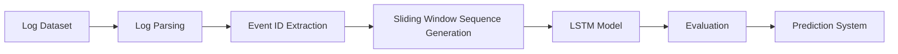

# System Architecture Diagram

Pipeline summary:
- Log data is parsed to extract EventIds from traces.
- Event sequences are transformed into fixed-length windows.
- LSTM learns sequential failure patterns.
- Evaluation provides confusion matrix, ROC, and key metrics.
- Prediction system supports CLI and Streamlit demo.
